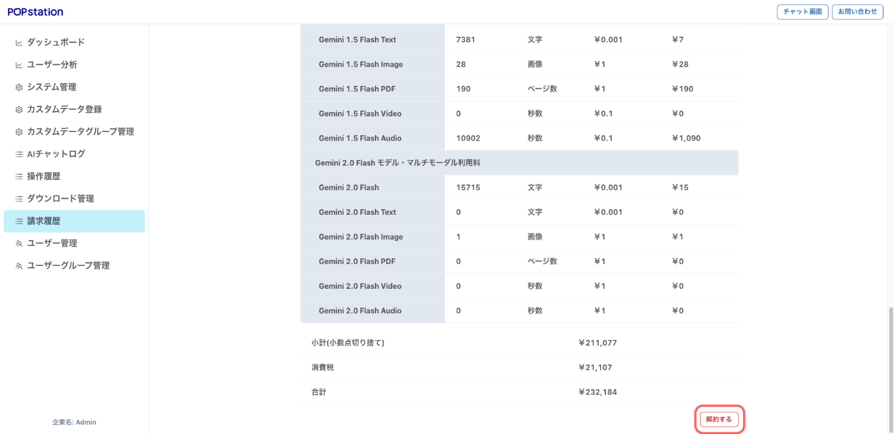

# サービスの解約

### 解約方法

メイン画面の左側から「管理」＞「請求履歴」をクリックします。

ご利用情報の最下位の【解約する】をクリックし、フォームに必要事項を記載の上、送信してください。

解約申請を受け取り次第、受領のご案内と解約日についての詳細をメールでご連絡いたします。

※初回契約の３ヶ月間で解約をご希望される場合は、[カスタマーサポート](https://form.run/@popstation-help)へご連絡ください。

