# チャット詳細

### 条件を変更して再実行

AIモデルやモードの条件を変更して再度実行することができます。

* AIモデルを変更する場合
「AIモデル」を選択すると、モデルを変更することができます。

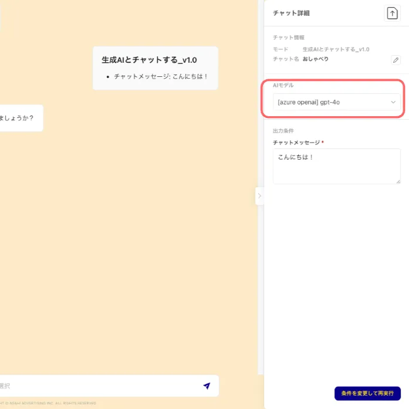

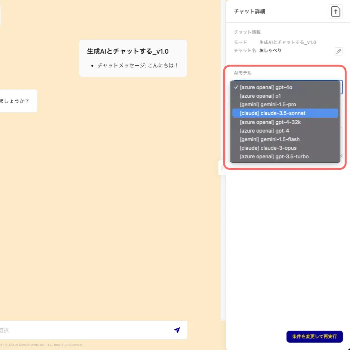
* モードの条件を変更する場合
モード条件入力欄からモードの条件を変更することができます。

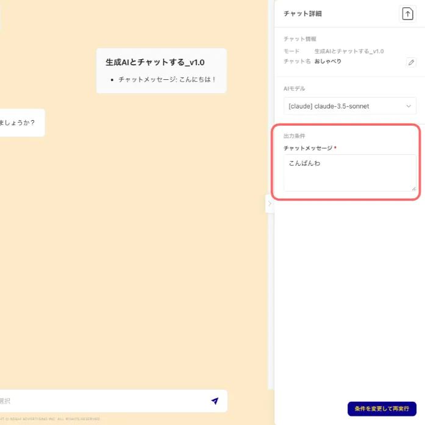
* 「条件を変更して再実行」ボタンをクリックすると、条件を変更した上で、再度モードが実行されます。

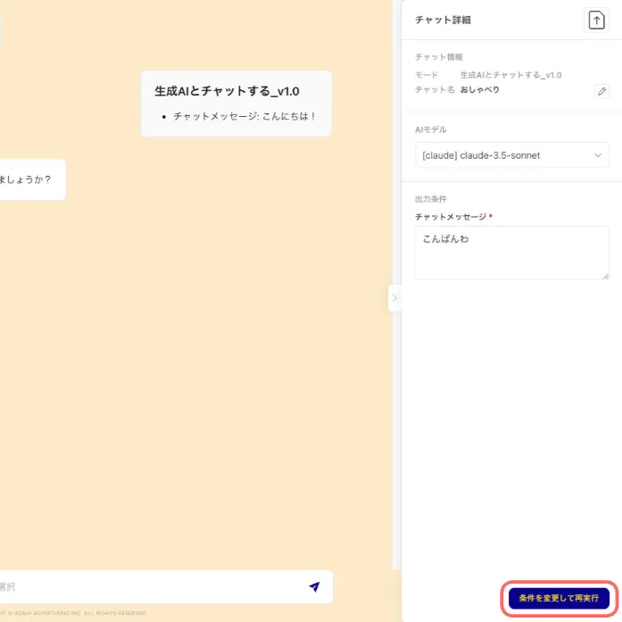

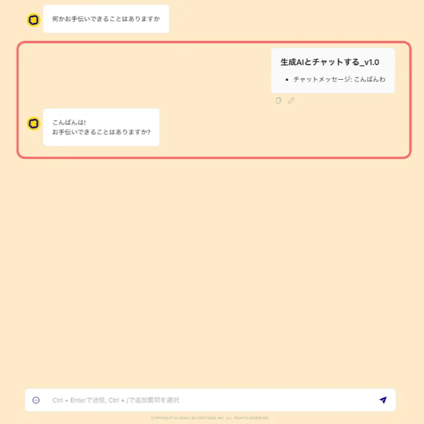

### ファイル入力機能（マルチモーダル機能）

マルチモーダルとは、異なる種類のデータ（テキスト、画像、音声など）を同時に扱うAI技術です。

マルチモーダルに対応しているAIモデル*では、画像・PDF・動画・音声データ・テキストファイルの入力**ができます。

アップロード可能なファイル数は1つのチャットで最大10個までです。

* 現在、gemini-2.0-flash, gemini-1.5-pro, gemini-1.5-flash のみ対応

**対応しているファイル形式は下記の通り

データを添付する方法は「ファイルのアップロード」と「クリップボードからの貼り付け」の2種類あります。

#### 1. 「ファイルのアップロード」の場合

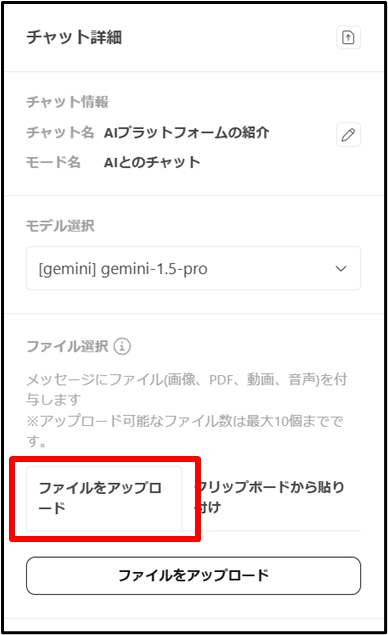

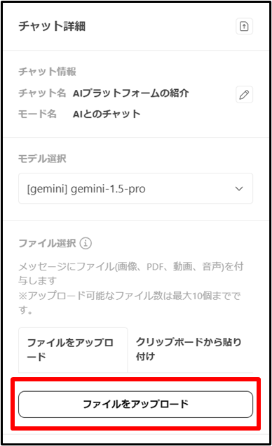

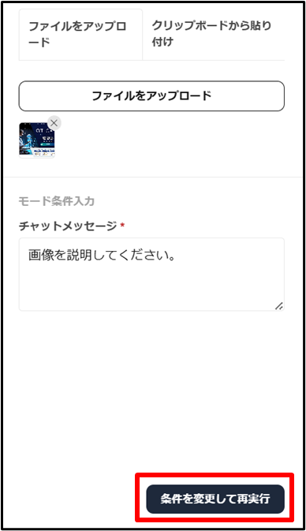

#### 2. 「クリップボードからの貼付け」の場合（画像のみ）

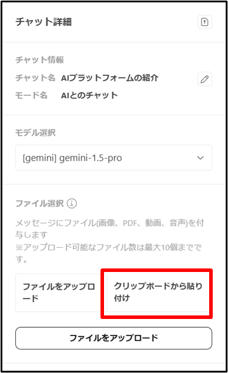

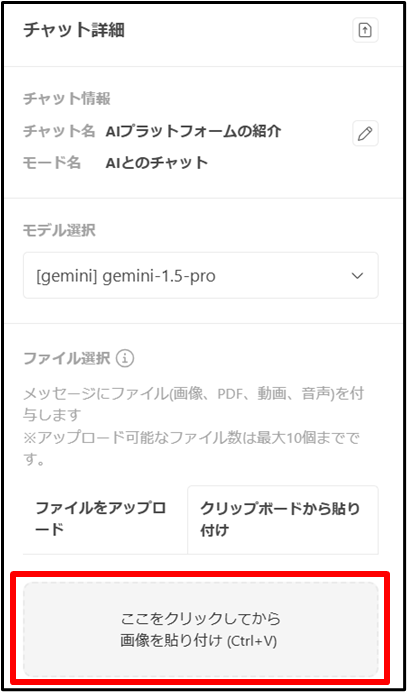

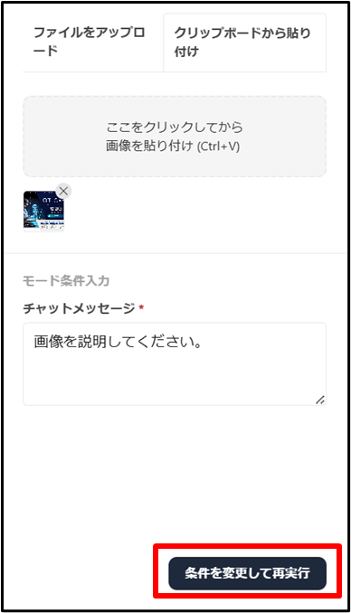

### チャット履歴のエクスポート

チャットの内容をテキストデータまたは画像データとしてダウンロードすることができます。

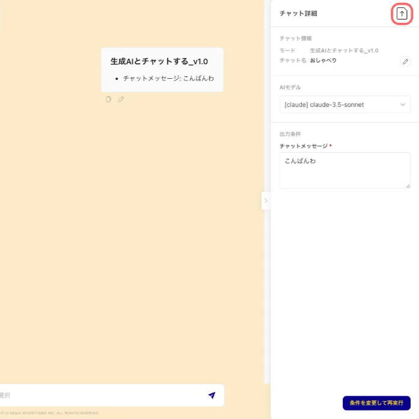

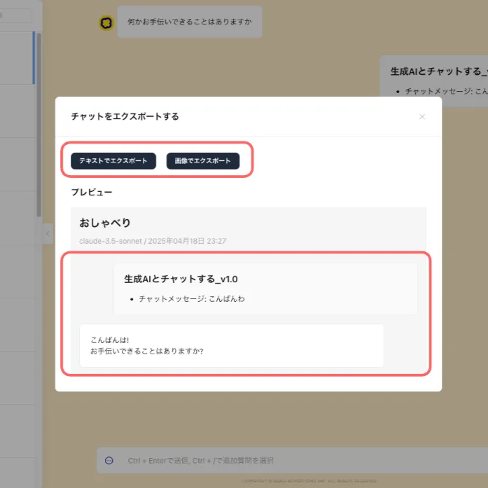

### チャット名の変更

チャット名はモード実行時にAIが自動で作成しますが、任意の名前に変更することもできます。

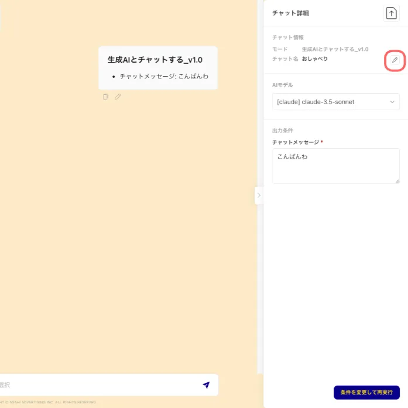

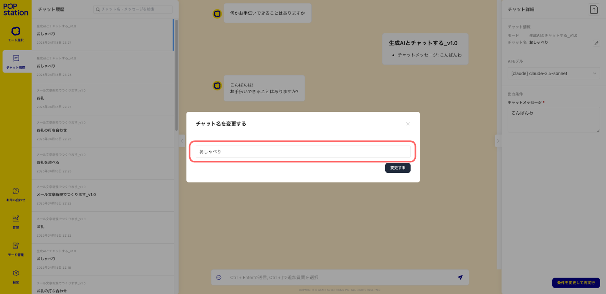

