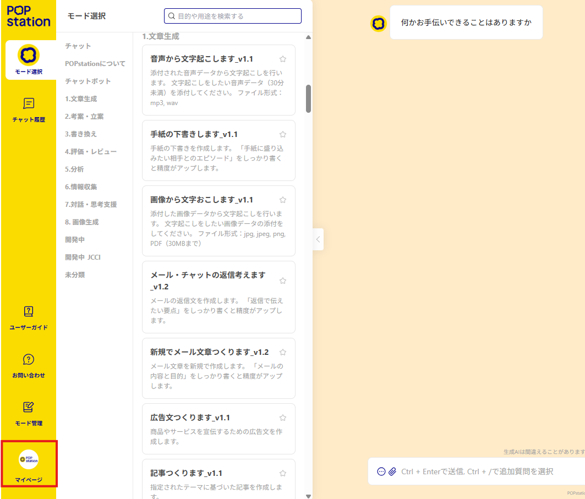
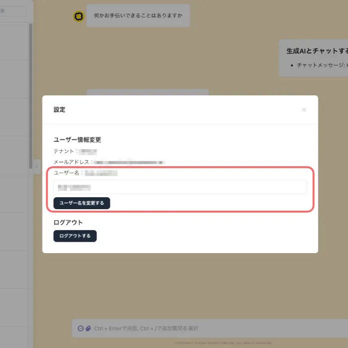
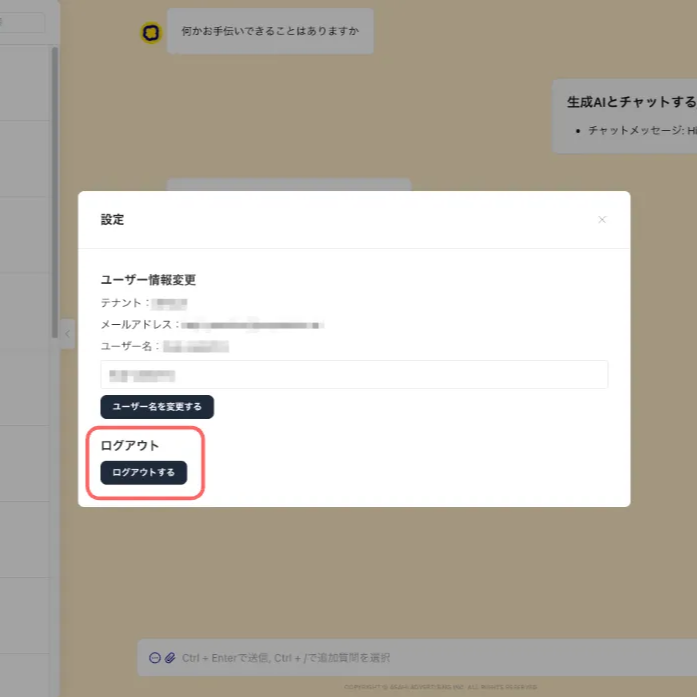

# マイページ

### マイページ画面の表示方法

メイン画面から「マイページ」をクリックすることでマイページ画面を表示することができます。

#### ユーザー名の変更

ユーザー名の変更をする場合は、テキストボックスにユーザー名を入力して、「ユーザー名を変更する」ボタンをクリックしてください。

システム管理者の指示に従い、「部署名　氏名」などに変更して利用してください。

#### ログアウト

ログアウトする場合は、「ログアウトする」ボタンをクリックしてください。

ログアウト後はログイン画面に遷移します。

