# モード

### モードの利用

モード機能を利用する基本的な手順は以下の通りです。

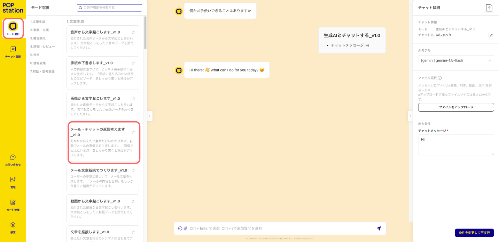
> 🤖 **Image Meta**: POPstationのメイン画面左側に並ぶモードのひとつが強調されています

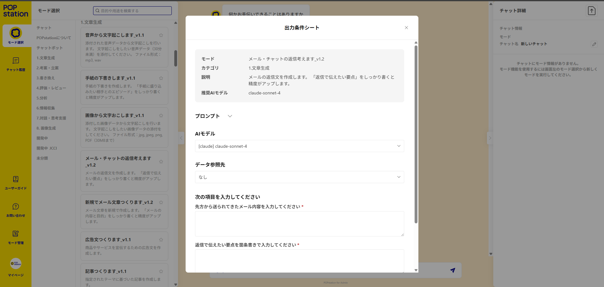
> 🤖 **Image Meta**: POPstationのメイン画面左側に並ぶモードのひとつが選択され、「出力条件シート」フォームがモーダルで画面に表示されている

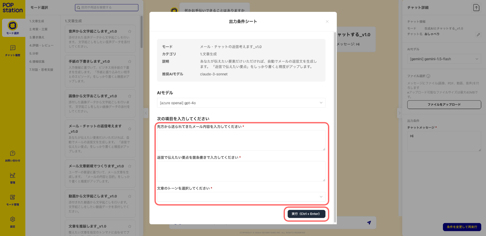
> 🤖 **Image Meta**: メイン画面上にモーダルのフォーム「出力条件シート」が表示されている。エンドユーザーが入力する箇所が強調されている

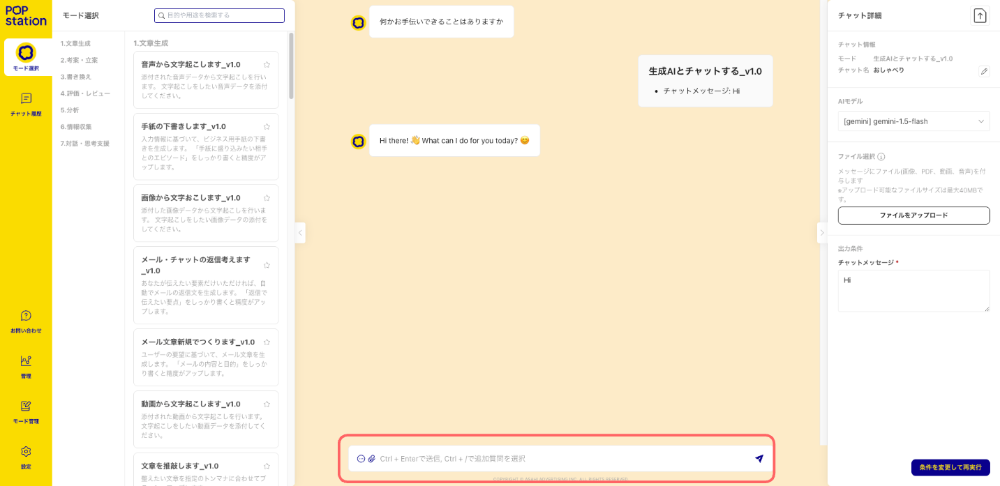
> 🤖 **Image Meta**: POPstationのメイン画面中央にAIの回答が表示されている。追加の質問や依頼をするためのメッセージボックスは、AIの回答が表示されいるエリアの下部に表示されている。

### モードお気に入り機能

よく使うモードをモード選択画面上部に固定することができます。

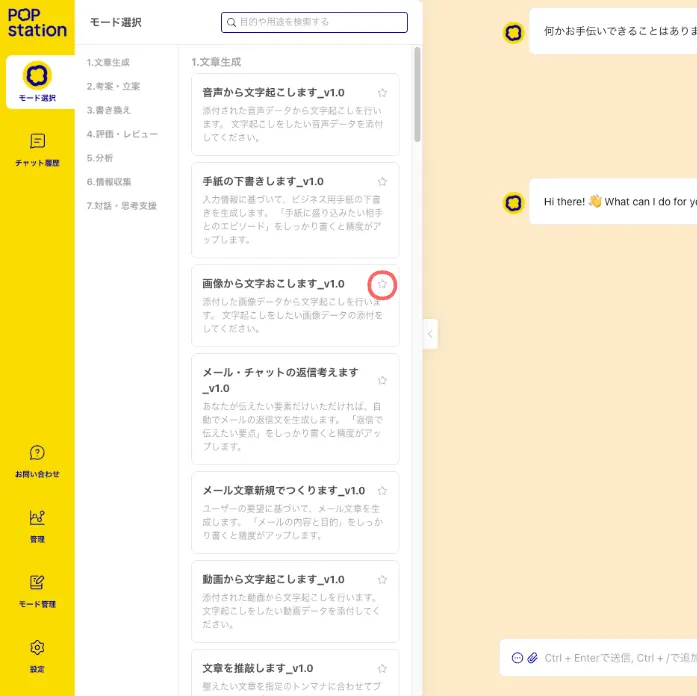
> 🤖 **Image Meta**: POPstationメイン画面左側モードが並んでいる部分。モードの名前の横にお気に入りボタンが表示されている。

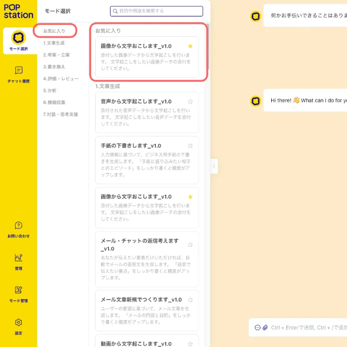
> 🤖 **Image Meta**: POPstationメイン画面左側、モードのカテゴリに「お気に入り」が追加され、先の操作でお気に入りボタンを押したモードが表示されいてる様子

### モード検索

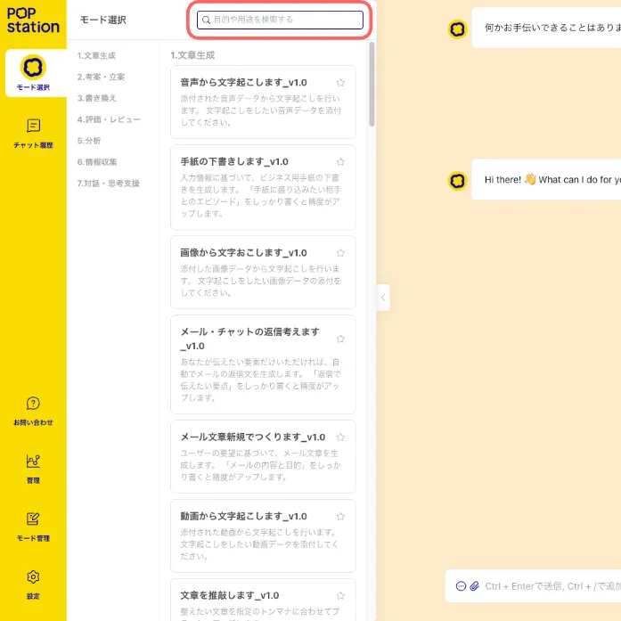
> 🤖 **Image Meta**: POPstationメイン画面の左側上部「モード選択」という文字の右側にモードを検索できるテキストボックスが表示されている

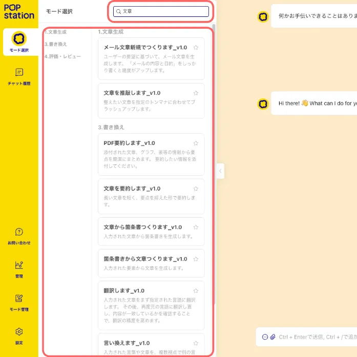
> 🤖 **Image Meta**: POPstationメイン画面でモードの検索が実行された結果の画面。検出されたモードが検索ボックスの下部のエリアに並んでいる。

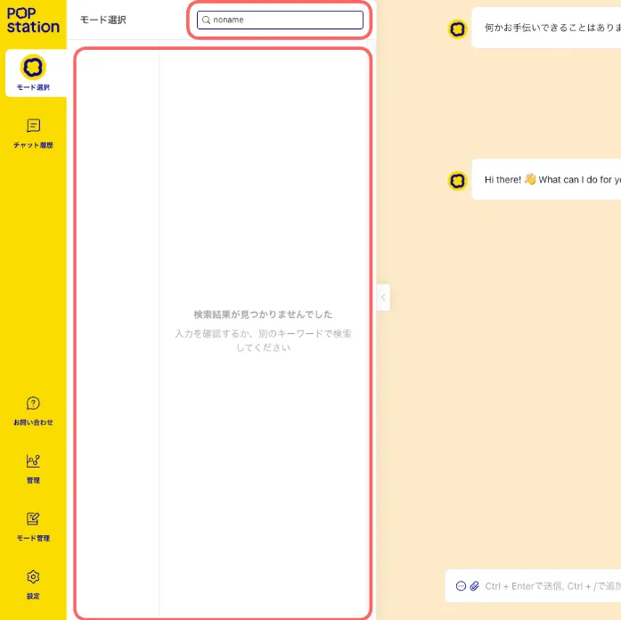
> 🤖 **Image Meta**: POPstationメイン画面でモードの検索が実行された結果の画面。検索ボックスの下部にはモードは表示されず「検索結果が見つかりませんでした。入力を確認するか、別のキーワードで検索してください」というテキストが表示されている。

### AIモデルの変更

AIモデルを変更してモードを実行することができます。

* 出力条件シート「AIモデル」ドロップダウンから、モード実行に使用するAIモデルを変更することができます。

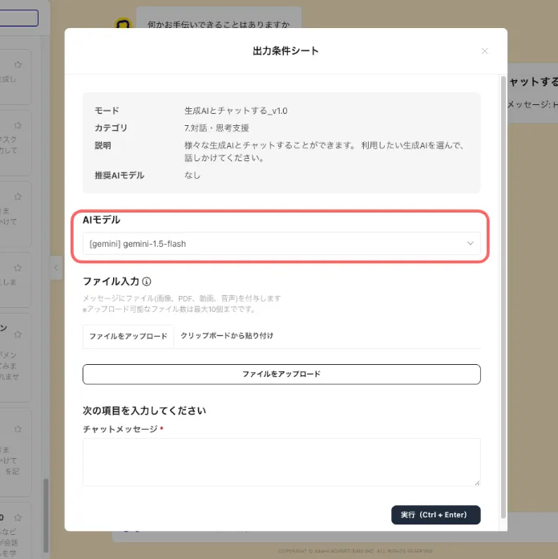
> 🤖 **Image Meta**: POPstationのメイン画面でモードを選択後、メイン画面上にモーダルのフォーム「出力条件シート」が表示されている。フォーム内の「AIモデル」というドロップダウンが表示されている。

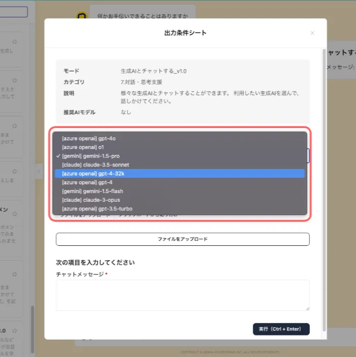
> 🤖 **Image Meta**: POPstationのメイン画面でモードを選択後、メイン画面上にモーダルのフォーム「出力条件シート」フォーム内の「AIモデル」というドロップダウンで、ドロップダウンが展開されている状態。選択肢には使うことができるAIモデルが並んでいる。

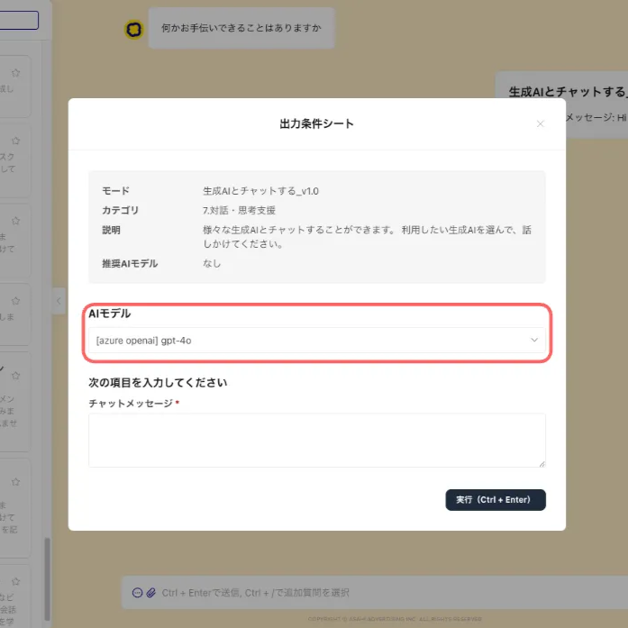
> 🤖 **Image Meta**: POPstationのメイン画面でモードを選択後、メイン画面上にモーダルのフォーム「出力条件シート」が表示されている。フォーム内の「AIモデル」というドロップダウンでAIモデルを変更した画面。

### ファイル入力機能（マルチモーダル機能）

マルチモーダルとは、異なる種類のデータ（テキスト、画像、音声など）を同時に扱うAI技術です。

マルチモーダルに対応しているAIモデル*では、画像・PDF・動画・音声データ・テキストファイルの入力**ができます。

アップロード可能なファイル数は1つのチャットで最大10個までです。

* 現在、gemini-2.0-flash, gemini-1.5-pro, gemini-1.5-flash のみ対応

**対応しているファイル形式は下記の通り

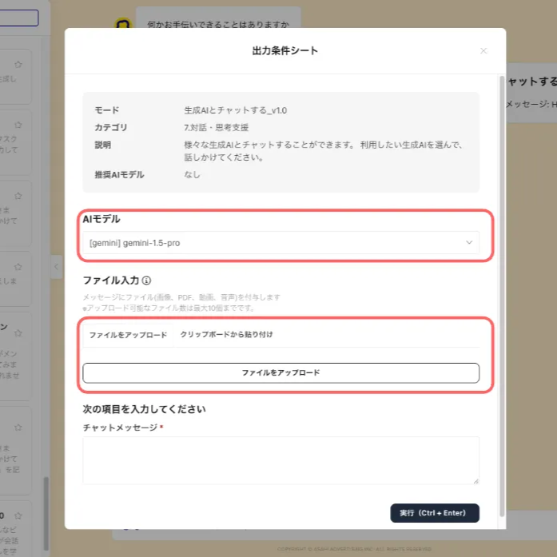
> 🤖 **Image Meta**: POPstationのメイン画面でモードを選択後、メイン画面上にモーダルのフォーム「出力条件シート」が表示されている。フォーム内ではマルチモーダルに対応したエリア「ファイルをアップロード」「クリップボードから貼り付け」タブが表示されている

データを添付する方法は「ファイルのアップロード」と「クリップボードからの貼り付け」の2種類あります。

#### 1. 「ファイルのアップロード」の場合

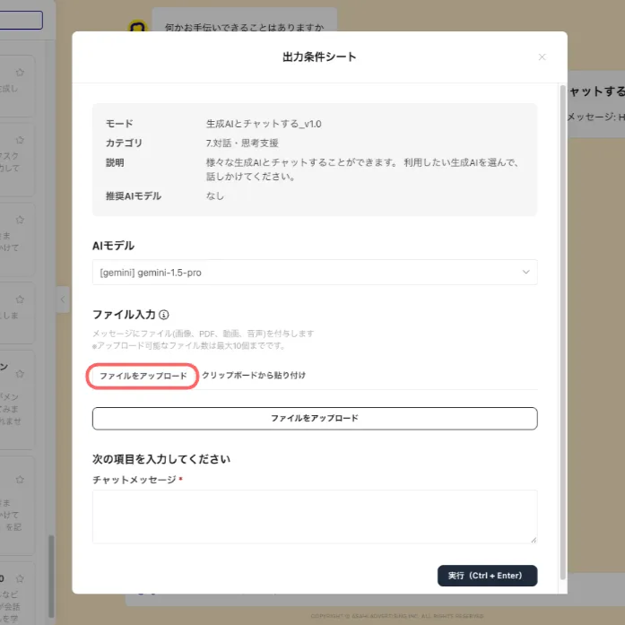
> 🤖 **Image Meta**: POPstationのメイン画面でモードを選択後、メイン画面上にモーダルのフォーム「出力条件シート」が表示されている。フォーム内ではマルチモーダルに対応したエリア「ファイルをアップロード」「クリップボードから貼り付け」タブが表示され、そのうち「ファイルをアップロード」を選択した状態。

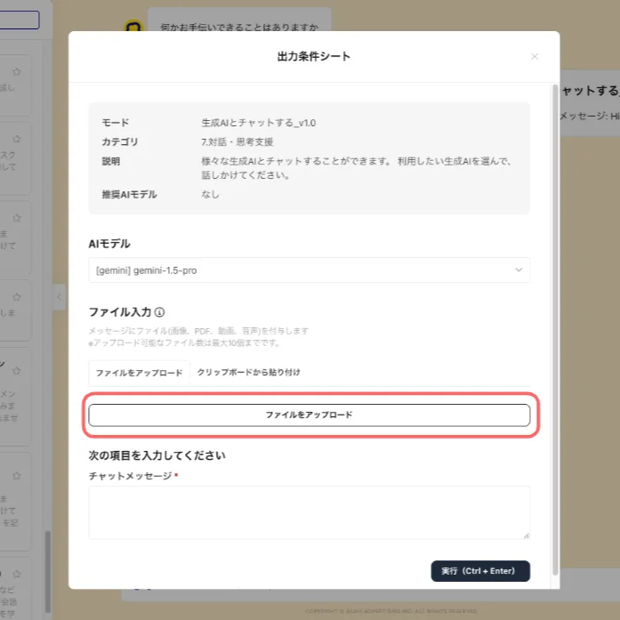
> 🤖 **Image Meta**: POPstationのメイン画面でモードを選択後、メイン画面上にモーダルのフォーム「出力条件シート」が表示されている。フォーム内ではマルチモーダルに対応したエリア「ファイルをアップロード」「クリップボードから貼り付け」タブが表示され、そのうち「ファイルをアップロード」を選択した状態。タブの下に「ファイルアップロード」ボタンがある。

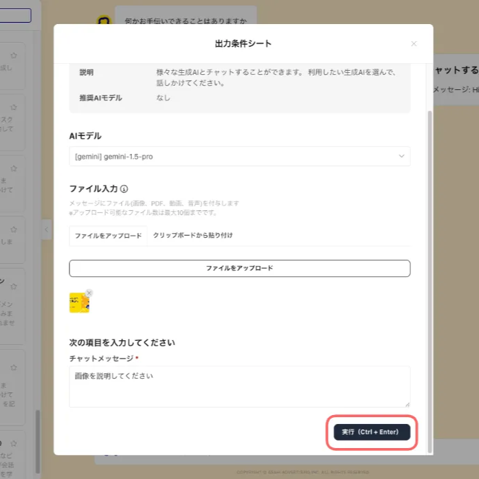
> 🤖 **Image Meta**: POPstationのメイン画面でモードを選択後、メイン画面上にモーダルのフォーム「出力条件シート」が表示されている。フォーム内ではマルチモーダルに対応したエリア「ファイルをアップロード」「クリップボードから貼り付け」タブが表示され、そのうち「ファイルをアップロード」を選択後、ファイルをアップロードした状態。フォームに実行ボタンが表示されている。

> 🤖 **Image Meta**: POPstationのメイン画面中央。ファイルアップロード経由でAIの回答が生成された様子。

#### 2. 「クリップボードからの貼付け」の場合（画像のみ）

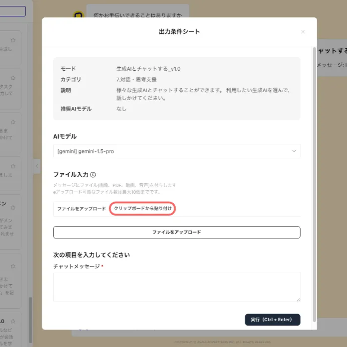
> 🤖 **Image Meta**: POPstationのメイン画面でモードを選択後、メイン画面上にモーダルのフォーム「出力条件シート」が表示されている。フォーム内ではマルチモーダルに対応したエリア「ファイルをアップロード」「クリップボードから貼り付け」タブが並んで表示され、そのうち「クリップボードから貼り付け」を選択しようとしている

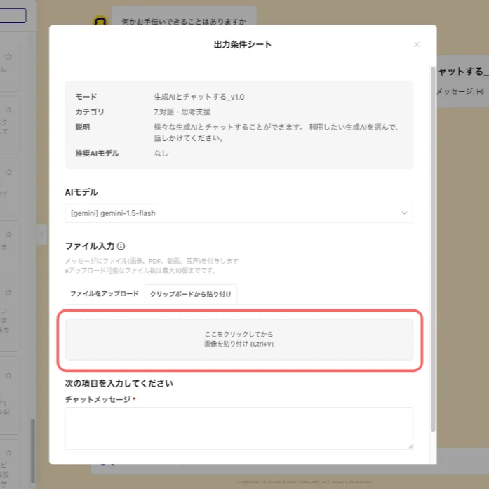
> 🤖 **Image Meta**: POPstationのメイン画面でモードを選択後、メイン画面上にモーダルのフォーム「出力条件シート」が表示されている。フォーム内ではマルチモーダルに対応したエリア「ファイルをアップロード」「クリップボードから貼り付け」タブが表示され、そのうち「クリップボードから貼り付け」を選択した状態。タブの下部にクリップボードから画像を貼り付けるためのエリアが表示され「ここをクリックしてから画像を貼り付け」と書かれている。

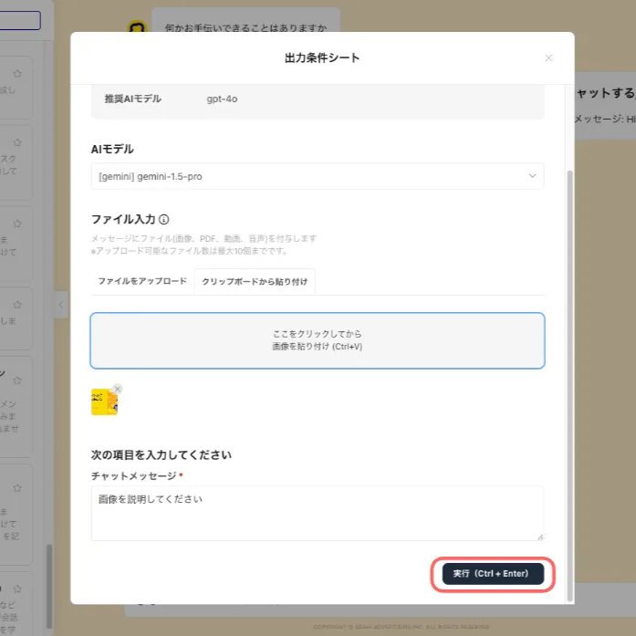
> 🤖 **Image Meta**: POPstationのメイン画面でモードを選択後、メイン画面上にモーダルのフォーム「出力条件シート」が表示されている。フォーム内ではマルチモーダルに対応したエリア「ファイルをアップロード」「クリップボードから貼り付け」タブが表示され、そのうち「クリップボードから貼り付け」を選択後、画像を貼り付けた状態。フォームに実行ボタンが表示されている。

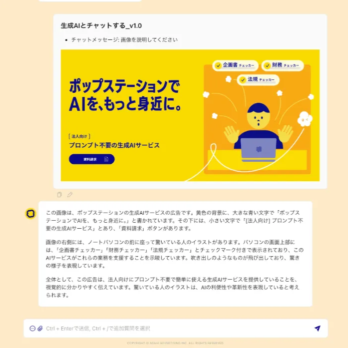
> 🤖 **Image Meta**: POPstationのメイン画面中央。クリップボードからの貼り付け経由でAIの回答が生成された様子。

### Web検索機能

Web検索に対応しているモードでは、POPstationからWebページの検索を実行してその検索結果から回答を生成することができます。

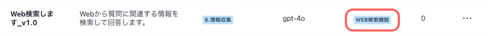
> 🤖 **Image Meta**: モードの管理画面。表示されているモードに対して「WEB検索機能」と記載されている

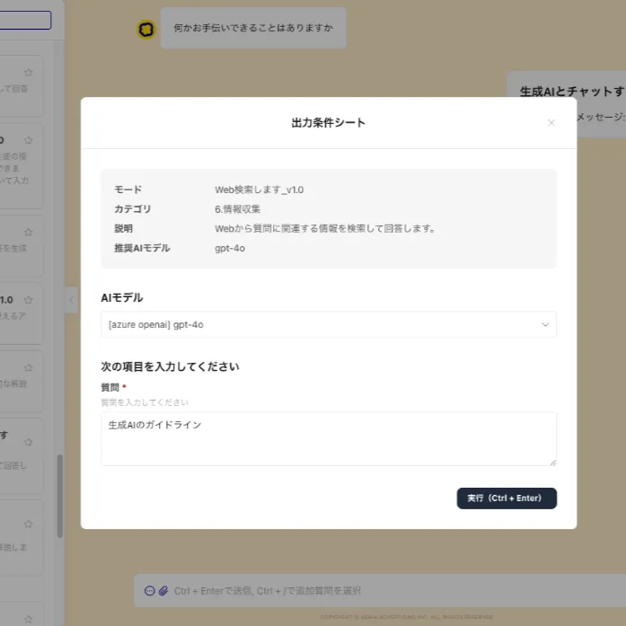
> 🤖 **Image Meta**: POPstationのメイン画面でWEB検索に対応したモードを選択後、メイン画面上にモーダルのフォーム「出力条件シート」が表示されている。テキストボックスにWEB検索条件が入力できるようになっている様子。

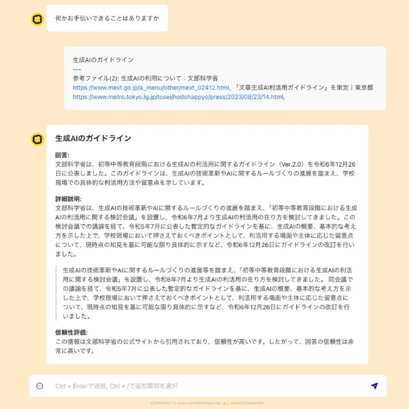
> 🤖 **Image Meta**: POPstationのメイン画面中央。Web検索した結果とモードに従ってAIの回答が生成された様子。

### URL読込機能

URL読込に対応しているモードでは、入力したURLのページから回答を生成することができます。

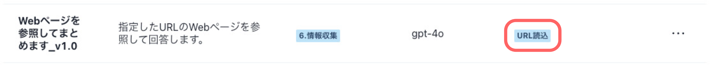
> 🤖 **Image Meta**: モードの管理画面。表示されているモードに対して「URL読込」と記載されている

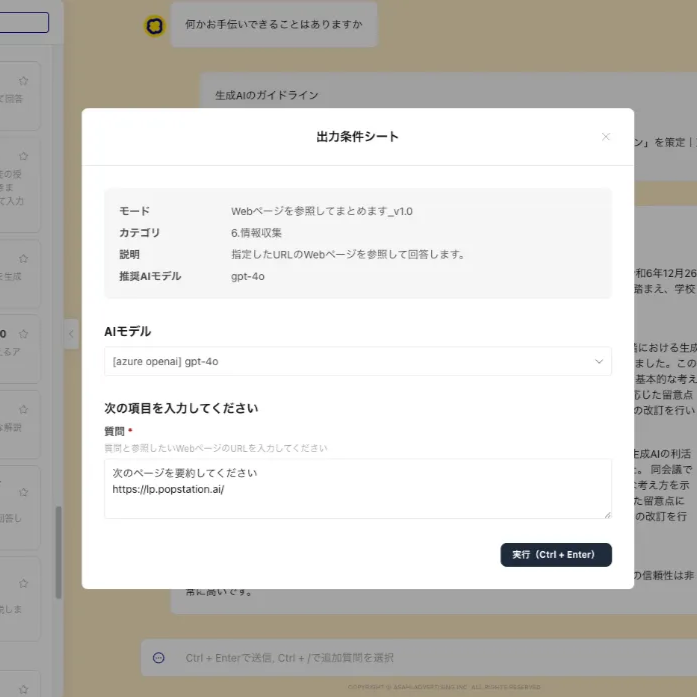
> 🤖 **Image Meta**: POPstationのメイン画面でWEB検索に対応したモードを選択後、メイン画面上にモーダルのフォーム「出力条件シート」が表示されている。テキストボックスにURLとモードの条件に従ったAIへの質問が書かれている。

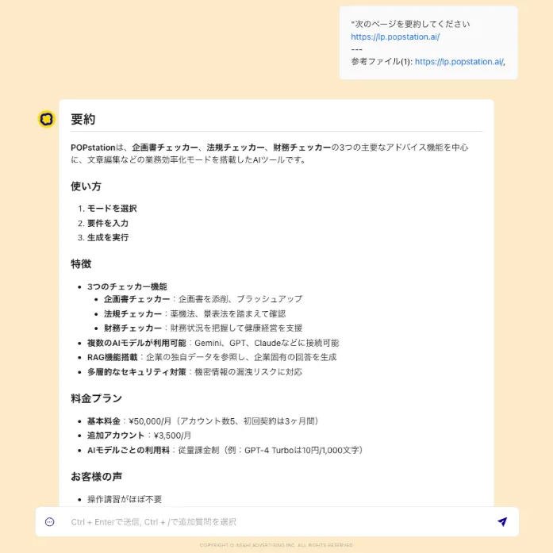
> 🤖 **Image Meta**: POPstationのメイン画面中央。URLを参照した結果とモードに従ってAIの回答が生成された様子。

[モードの管理 はこちら](/1cb25c9ec4d681c6b317c080fee1a0f3)

[推奨モードのインポート はこちら](/1cb25c9ec4d681de9a08ee48e16e8cd0)

