# モードカテゴリ管理

### モードカテゴリ画面への遷移

モードカテゴリの設定を行うには、モード管理画面に移動する必要があります。

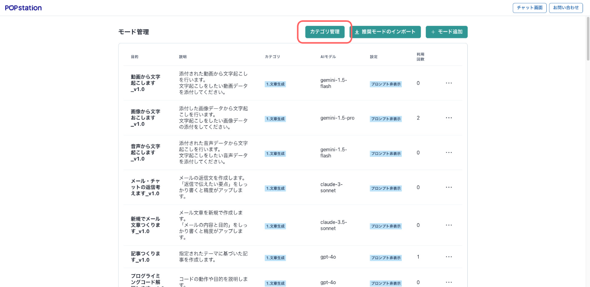

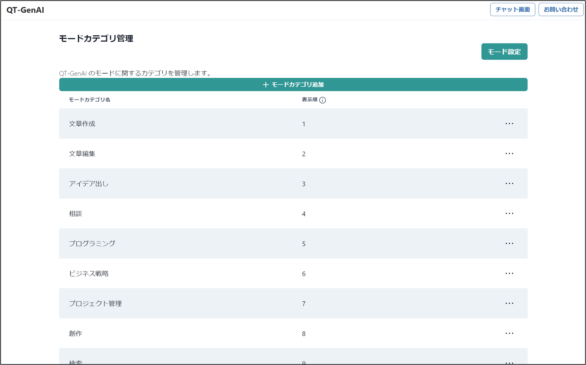

### モードカテゴリの追加

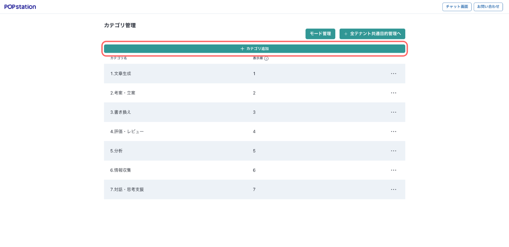

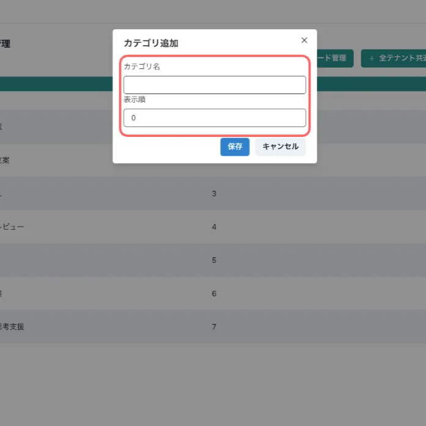

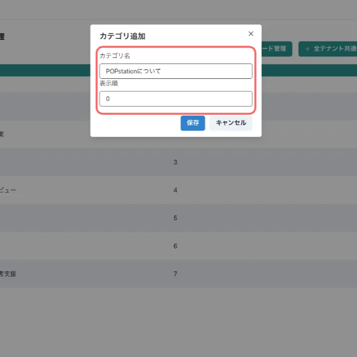

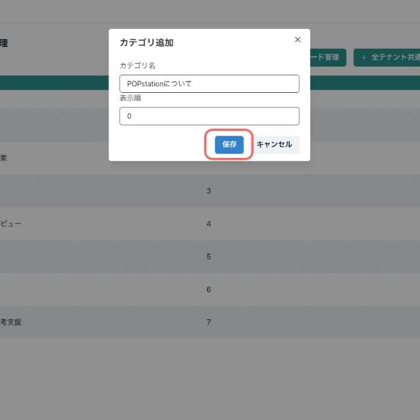

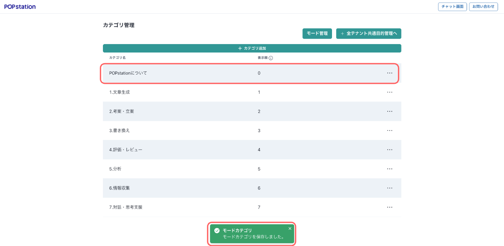
* 注意点: 表示順は、モードカテゴリ画面と、モード追加・修正画面での参照データフォルダでのプルダウンリストにのみ反映されます。メイン画面の表示順には反映されません。

### モードカテゴリの変更

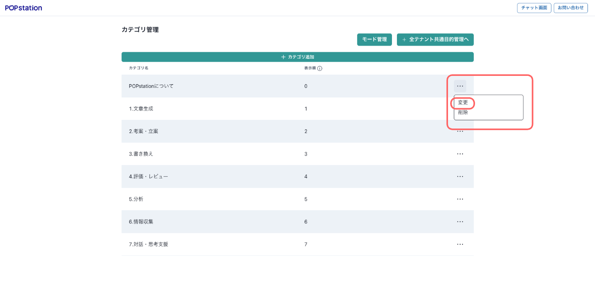

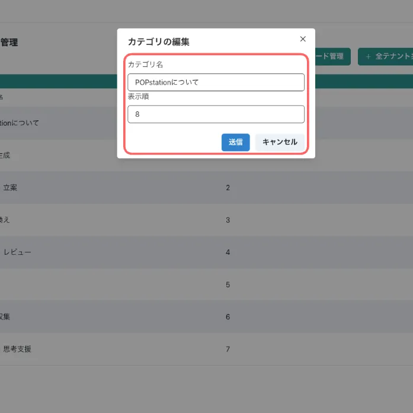

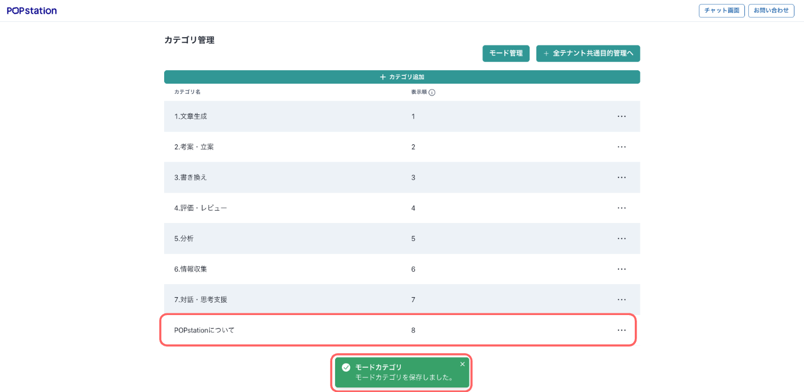

### モードカテゴリの削除

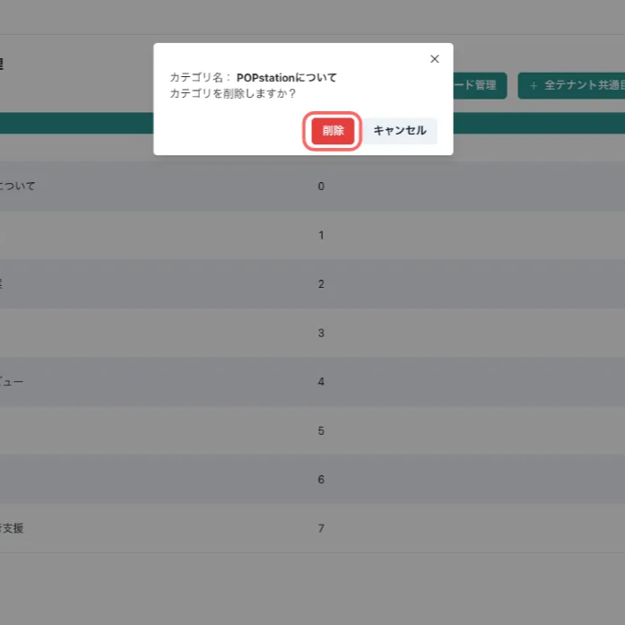

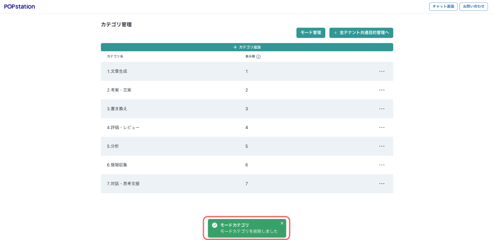

