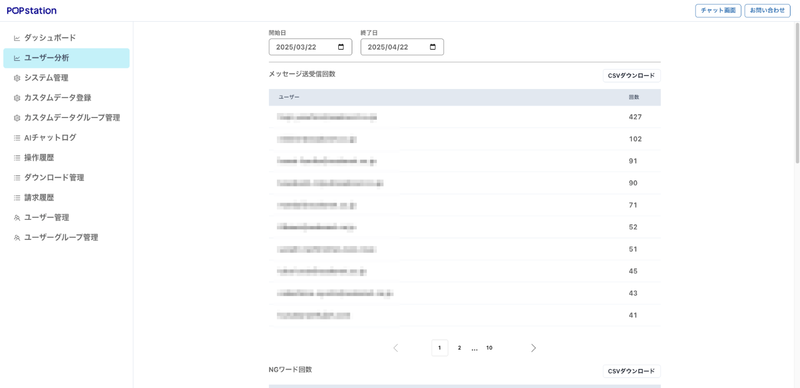
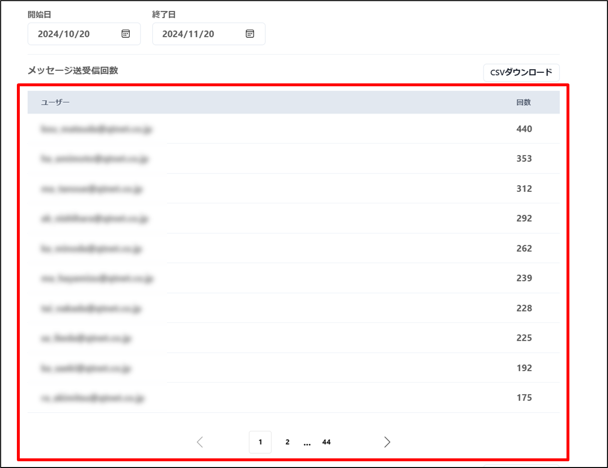
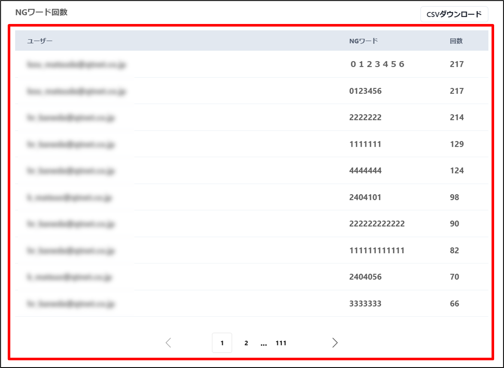
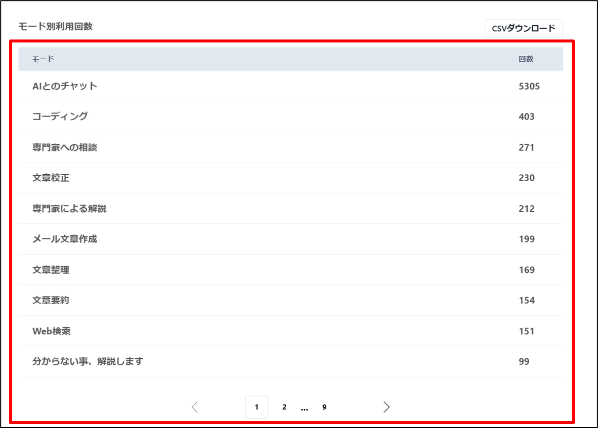
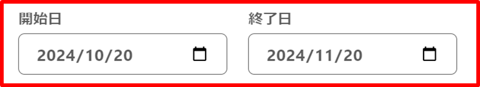
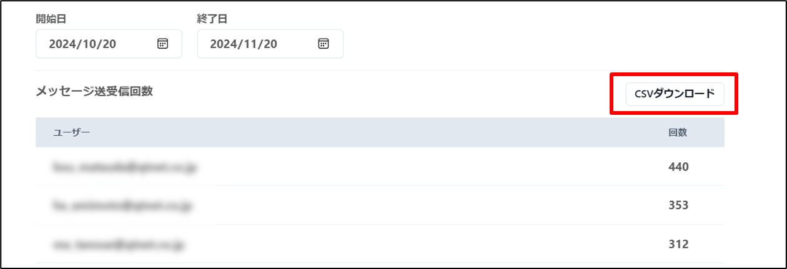
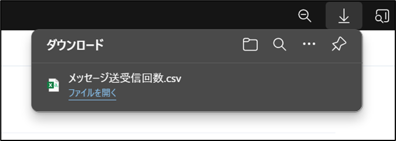

# ユーザー分析

### ユーザー分析画面への遷移

ユーザー分析を行うには、ユーザー分析画面に移動する必要があります。

管理画面左側より、「ユーザー分析ボタン」をクリックして、ユーザー管理画面にアクセスします。

### 分析期間設定

* メッセージ送受信回数

* NGワード回数

* モード別利用回数

### 分析データのダウンロード

各分析データはCSVファイルとしてダウンロードすることが可能です。

