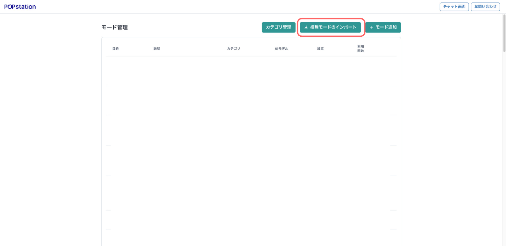
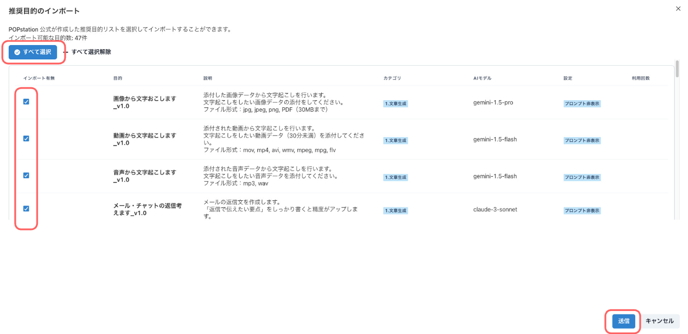
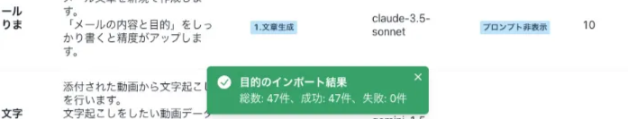
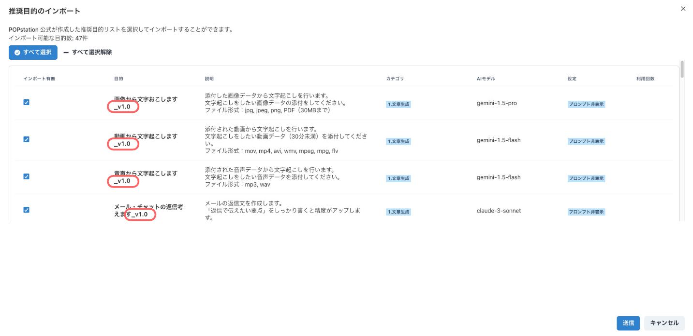

# 推奨モードのインポート

### 推奨モードのインポート・更新手順

POPstation運営チームが作成した推奨モードをインポート・更新する場合は、以下の手順を行ってください。

### 推奨モードの追加更新について

推奨モードは利便性を向上させるために随時追加や更新が行われます。推奨モードをインポートして使われる際は、システム管理者により定期的なインポートと更新を行ってください。

* モード名の後ろにバージョン情報を入れていますので、更新の参考としてください。

### 推奨モード一覧

現在（2026.2.1 ）の推奨モード一覧です

