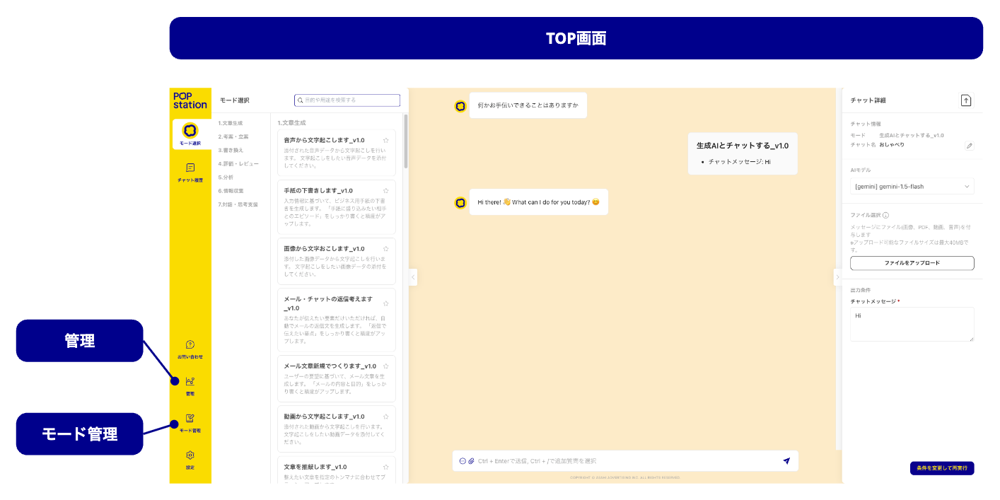
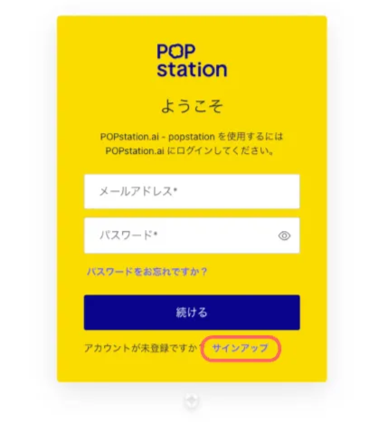
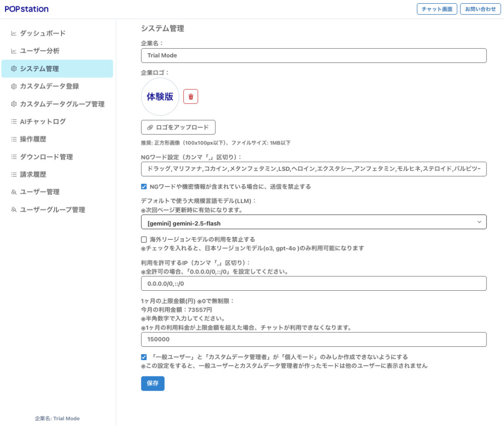
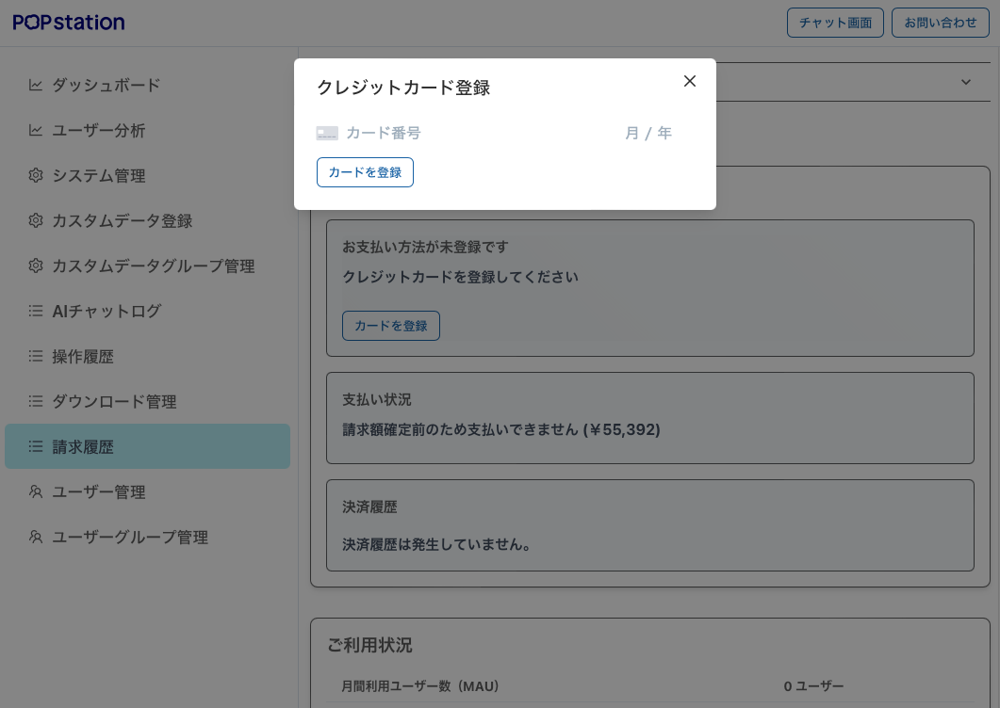
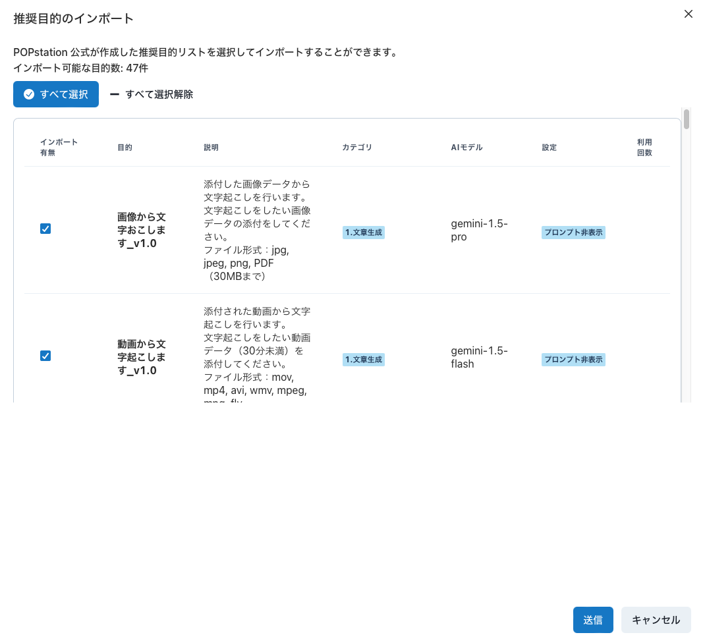
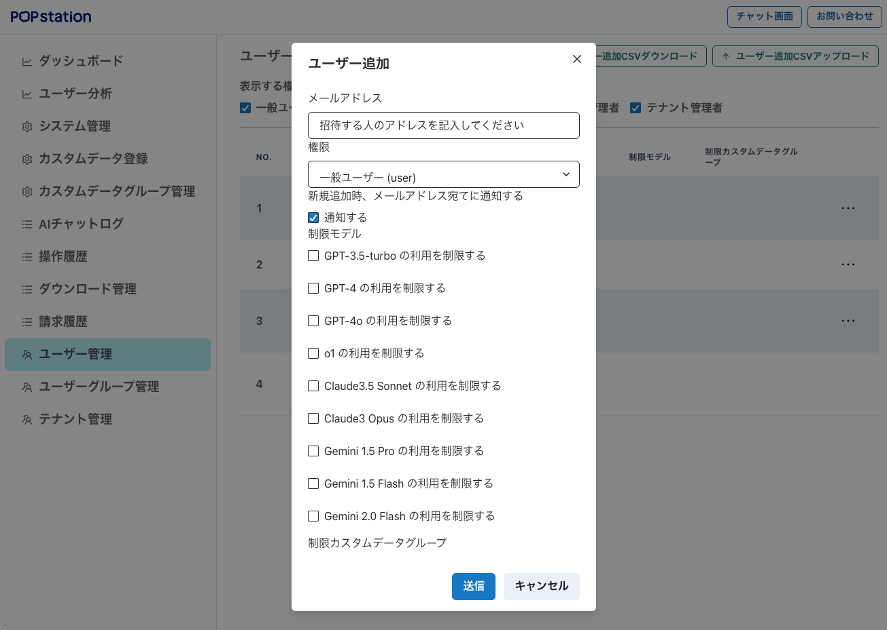

# 管理者向け：かんたんスタートガイド

管理者向けの初期設定ガイドです。POPstationをはじめて利用するシステム管理者を対象としています。以下の手順に従って、初期設定を完了させてください。

事前準備：次の準備をしてください。

* アカウント開設のお知らせメール
* 管理者メールアドレス（お申込者アドレス）
* お支払い方法が「クレジットカード決済」のお客様は、お支払い用のクレジットカード

## Step 1：サインアップ

管理者としてサインアップします。

* お申し込みいただいたメールアドレスへ（ support@popstation.ai）からアカウント開設のお知らせメールが届きます。
* メールの案内に沿って、POPstationのサイト（[https://popstation.ai/](https://popstation.ai/)）にアクセスしてください。
* 【サンアップ】ボタンからパスワードの設定を行なってください。
* 登録完了後、TOP画面に遷移します。

※既にPOPstationにサインアップをしている方は、同じPWになります。

## Step 2：システムの設定

POPstationをご利用いただくためのシステム設定を行います。

* TOPページ左下【管理】＞【システム管理】を開いてください。
* 各項目を記入してください。

（例）

＜NGワード設定＞

以下のリストの登録を推奨しています。

* 各項目の記入を終えたら【保存】をクリック。システム設定は完了です。

＜システム設定項目の詳細＞

## Step 3：クレジット決済のお客様のみ（カード登録）

お支払いのためのクレジットカードを登録します。

* TOPページ左下【管理】＞【請求履歴】を開いてください。
* 【カードを登録】からクレジットカードを登録してください。

## Step 4：推奨モードのインポート

POPstationには、「モード」と呼ばれる特定のタスクに特化した回答を生成する機能があります。この機能を利用することで、AIとのスムーズな会話が実現します。

* TOPページ左下【モード管理】を開いてください。
* ページ上部【推奨モードのインポート】を押下。
* 【すべて選択】もしくは、お好みのモードを選択
* 【送信】を押下するとダウンロードされます。
※POPstation運営チームが提供する「推奨モード」は不定期でアップデートされます。アップデート版をご利用いただく場合、こちらの作業同様にインポート操作をしていただくと、モードが上書きされます。

※オリジナルのモードをつくることができます。詳細は[【モード管理】について](/1cb25c9ec4d6800a86efd7a09e64c08a#1cb25c9ec4d680ef8a99ece76ddc04ae)をご参照ください。

## Step 5：ユーザーの追加

POPstationにユーザーを招待します。

* TOPページ左下【管理】＞【ユーザー管理】を開いてください。
* ページ上部【ユーザー追加】*からユーザーを追加してください。
* 以下の項目を入力してください
* 招待したい人のアドレス
* 権限を入力
* メール通知する場合に✅する*
* 制限モデル：使用させない場合に✅する
* 【送信】を押して完了です。

*招待されたユーザーへは「info@popstation.ai」より招待メールが届きますので、受信できるようにご設定ください。

登録手順の詳細や、各部署ごとなど組織単位でご利用する場合のグループ管理などは、[【ユーザー・グループ管理】](/1cb25c9ec4d6800a86efd7a09e64c08a#1cb25c9ec4d680e6a6a0c7db983321da)で詳細をご確認ください。

以上でセットアップ完了です。

使い方の詳細は、【[POPstationユーザーガイド](/1cb25c9ec4d6800a86efd7a09e64c08a)】をご参照ください。

AIを、もっと身近に。

POPstation

